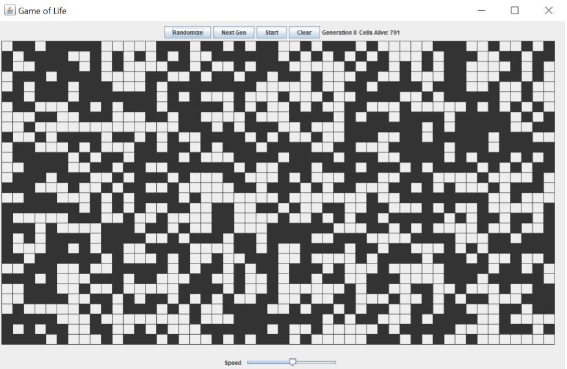
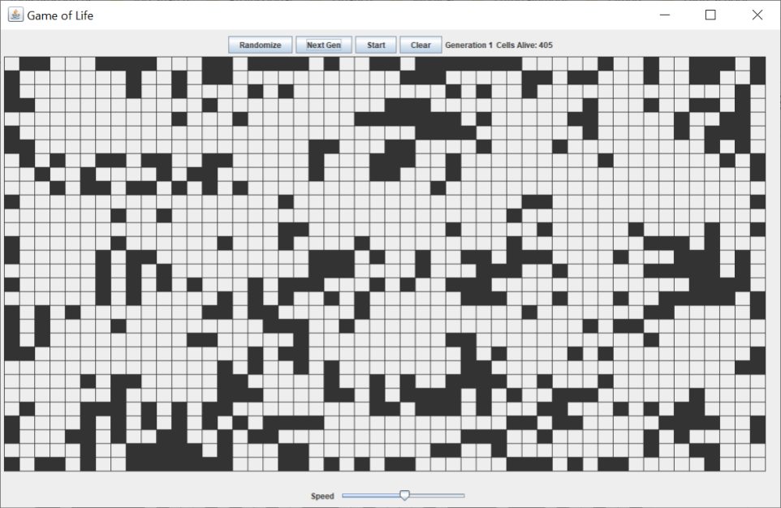
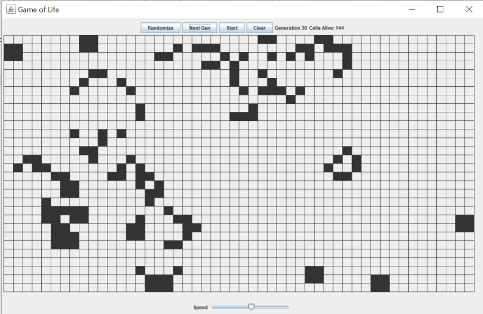

# Game of Life

A desktop simulation of the famous Conway’s Game of Life, the zero-player game and cellular automation devised by John Horton Conway in 1970.

- The user can set an initial pattern by using the mouse to toggle individual cell state or clicking on the “Randomize” button to obtain a random setup.
- The user can view the evolution generation by generation using the “Next Gen” button, or let the evolution go automatically and watch the patterns change.
- The speed of the automatic evolution is adjustable via a slider.
- The status of generation number and cell count are live updated on the game panel.

